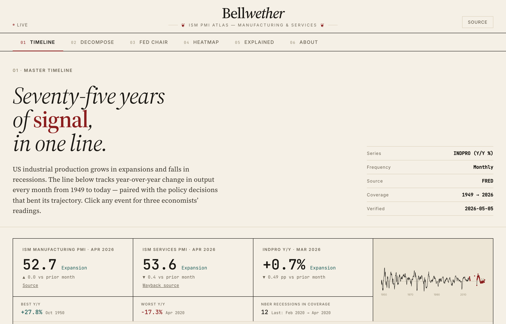
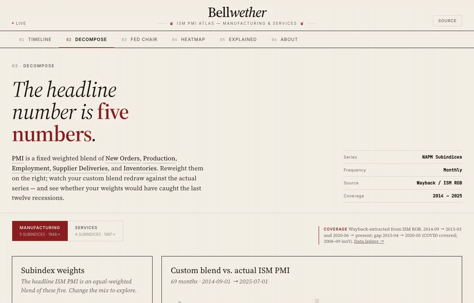
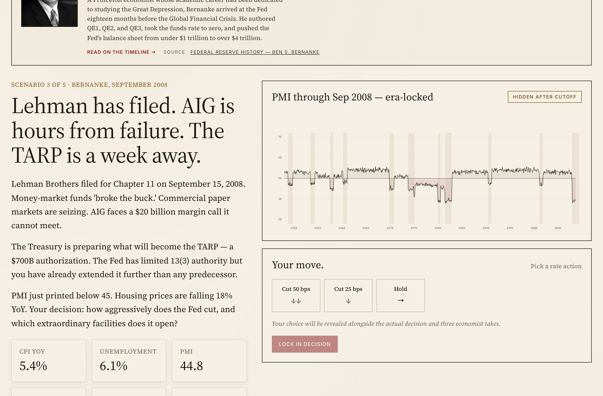
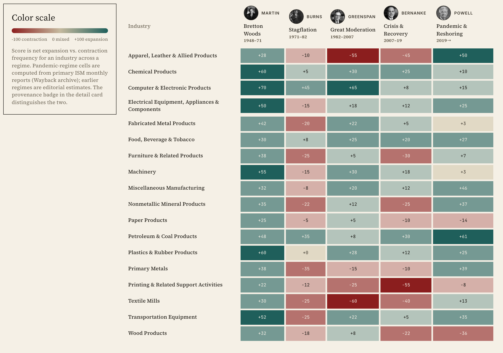

# Bellwether

> The economy's earliest tell, made explorable. Read the ISM PMI the way the Fed does.

[](https://bellwether-nine.vercel.app/)
[](https://github.com/RealMaxPower/bellwether/actions/workflows/ci.yml)
[](https://nextjs.org/)
[](LICENSE)

Bellwether is an interactive atlas of the ISM PMI suite — Manufacturing PMI (1948→present, 75+ years) and Services PMI (1997→present) — read alongside the US economic-policy decisions that shaped each era. The PMI is the economy's earliest monthly tell: a diffusion index that crosses 50 before GDP turns. Bellwether makes that signal something you can drive rather than a number you read once a month.

It's for the economically curious non-economist — anyone who sees "ISM Manufacturing PMI came in at 48.7" in the headlines and wants the machine behind it: what the number means, how it's built, and what it has caught (and missed) across seventy-five years of cycles.

**Try it live → [bellwether-nine.vercel.app](https://bellwether-nine.vercel.app/)**

**Status:** live — 7 modes, Manufacturing PMI back to 1948 (75+ years), Services PMI to 1997, per-cell data provenance, FRED-backed, no signup.

[](https://bellwether-nine.vercel.app/)

---

## Modes

| Mode | Route | What it does |
|--|--|--|
| **Timeline** | `/` | INDPRO Y/Y % spine 1949→present, with hand-curated ISM PMI markers, a separate Services PMI figure (1997→), and a policy lane of major US economic decisions. |
| **Decompose** | `/decompose` · `?report=services` | Reweight the headline subindices and backtest your blend against NBER recessions — Manufacturing (5 subindices) and Services (4). |
| **Fed Chair** | `/fed-chair` | Era-locked decision game with after-action review. Manufacturing PMI only; scenarios pre-date the Services PMI's 1997 launch. |
| **Heatmap** | `/heatmap` · `?report=services` | 18 industries × 5 policy regimes, for both Manufacturing and Services. |
| **PMI Explained** | `/pmi-explained` | How to read the ISM Reports on Business, with live Manufacturing and Services prints. |
| **About the data** | `/about-the-data` | Per-cell provenance ledger — every value traced to its source. |
| **Background** | `/background` | Illustrated timeline of the institutions and the sixteen Fed chairs. |

## Beyond the timeline — drive the signal



*The headline PMI is a fixed-weight blend of five subindices. In **Decompose**, move the weights and watch your custom blend redraw against the real series — then see whether your mix would have caught the last twelve recessions. ([static version](docs/screenshots/decompose.png).)*

| Fed Chair (`/fed-chair`) | Heatmap (`/heatmap`) |
|--|--|
| [](https://bellwether-nine.vercel.app/fed-chair) | [](https://bellwether-nine.vercel.app/heatmap) |
| Five inflection points, five charts that hide everything past the day of decision. Pick your action, then see what actually happened — and how three schools of thought read it. | The headline number is an average of eighteen industries. The matrix maps each one against five policy regimes, so you can see who won and who lost under what. |

---

## Quickstart

```bash
npm install
cp .env.example .env.local         # paste your FRED key
npm run refresh-data               # fetch FRED snapshots into data/fred/
npm run dev                        # http://localhost:3000
```

The build doesn't require FRED at runtime — all market data is checked-in JSON in `data/`. Re-run `npm run refresh-data` when you want fresher FRED snapshots, and `npm run import-prnewswire` to backfill the most recent ISM headline prints from ISM's monthly press releases on PRNewswire. ISM Wayback re-imports (for the post-2014 history and the per-month subindex / industry tables) are documented in [data/CONTRIBUTING.md](data/CONTRIBUTING.md).

## Stack

- **Frontend:** Next.js 16 App Router · TypeScript (strict, `noUncheckedIndexedAccess`) · Tailwind CSS + shadcn-style primitives
- **Charts:** D3 (`d3-shape`, `d3-scale`, `d3-array`) for the timeline and backtests
- **State:** Zustand (Fed Chair scenario state)
- **Data:** checked-in JSON, validated with Zod at load time; sourced from FRED, ISM Reports on Business via the Internet Archive, ISM press releases on PRNewswire, and a forecasts.org historical mirror
- **Testing:** Vitest
- **Analytics:** Vercel Analytics

No database, no auth.

## Repo layout

```
src/
  app/                            # Next.js App Router
    page.tsx                      # Timeline (default mode)
    decompose/page.tsx            # ?report=services for Services
    fed-chair/page.tsx            # scenario index
    fed-chair/[id]/page.tsx       # per-scenario runner
    heatmap/page.tsx              # ?report=services for Services
    pmi-explained/page.tsx
    about/page.tsx
    about-the-data/page.tsx
    background/page.tsx
    style-guide/page.tsx
  components/
    timeline/                     # PMITimeline, PolicyLane, etc.
    decompose/
    fed-chair/
    heatmap/
    background/
    pmi-explained/
    ui/                           # primitives — Button, Sheet, Card, Slider, etc.
  lib/
    data/                         # series loaders + Zod schemas
    content/                      # policies + glossary (data lives in `_policies-data.ts`, not MDX)
    decompose/                    # weighting math + backtest
    background/                   # illustrated timeline data
data/
  fred/*.json                     # FRED snapshots (INDPRO, IPMAN, FEDFUNDS, USREC, NAPM stubs)
  pmi-historical.json             # forecasts.org mirror, 1948 → 2014
  pmi-wayback.json                # ISM Mfg ROB via Internet Archive, 2014→present
  pmi-subindices-wayback.json     # the five Mfg subindices
  pmi-curated.{csv,json}          # Mfg headline rows from ISM press releases (PRNewswire) + hand entries
  nmi-wayback.json                # ISM Services ROB via Internet Archive
  nmi-subindices-wayback.json     # the four Services subindices
  nmi-curated.json                # Services headline rows from ISM press releases (PRNewswire)
  industry-monthly-wayback.json   # Mfg per-month industry growth/contraction lists
  services-industry-monthly-wayback.json
  sectors.json                    # Mfg heatmap (18 industries × 5 regimes)
  sectors-services.json           # Services heatmap
scripts/
  fetch-fred.ts                   # FRED refresh
  import-wayback-ism.ts           # Mfg headline scraper (Wayback Machine)
  import-wayback-subindices.ts    # Mfg subindices (Wayback Machine)
  import-wayback-industries.ts    # Mfg industry lists (Wayback Machine)
  import-wayback-nmi*.ts          # Services equivalents (Wayback Machine)
  import-prnewswire-ism.ts        # current-vintage Mfg + Services headlines from PRNewswire
  import-forecastsorg.ts          # historical mirror
  import-pmi-csv.ts               # CSV → JSON for hand-curated rows
  reconcile-ism.ts                # cross-checks
  verify-nber.ts                  # link health on NBER citations
```

## The data

Bellwether's edge is its provenance. Nothing is scraped live at request time — every series is a checked-in JSON snapshot, backfilled from several primary sources and cross-checked against each other:

- **FRED** for the macro spine (INDPRO, IPMAN, FEDFUNDS, USREC).
- **ISM Reports on Business** via the Internet Archive for the post-2014 headline, subindex, and per-industry history.
- **ISM press releases on PRNewswire** for current-vintage Manufacturing and Services prints.
- **A forecasts.org mirror** for the deep 1948→2014 history.

Every value is reproducible, and the **[per-cell provenance ledger](https://bellwether-nine.vercel.app/about-the-data)** traces each one to its source. See [data/CONTRIBUTING.md](data/CONTRIBUTING.md) for how the imports work and [data/LICENSING.md](data/LICENSING.md) for the per-source licensing posture before you redistribute the data.

## Conventions

- Files: kebab-case
- Components: PascalCase
- All exports get JSDoc
- Strict TypeScript — `noUncheckedIndexedAccess` is on, deal with `undefined`
- Max ~400 lines per file; split when bigger
- Data is validated with Zod at load time, not at use time

## Documentation

- **[docs/pmi-explainer.md](docs/pmi-explainer.md)** — the long-form explainer on reading the ISM Reports on Business.
- **[SETUP.md](SETUP.md)** — full local setup, environment variables, and the data-refresh workflow.
- **[DISCLAIMER.md](DISCLAIMER.md)** — what Bellwether is and is not (it is not investment advice).
- **[SECURITY.md](SECURITY.md)** — how to report a vulnerability.
- **[CITATION.cff](CITATION.cff)** — how to cite the project.

## Contributing

Contributions are welcome — especially data corrections, new policy events, and deeper provenance. Good first contributions: file a [data correction](.github/ISSUE_TEMPLATE/data_correction.yml) when you spot a value that disagrees with the primary source, or improve the explainer for one of the subindices. See **[CONTRIBUTING.md](CONTRIBUTING.md)** to get started and **[CODE_OF_CONDUCT.md](CODE_OF_CONDUCT.md)** for community expectations; bug reports and feature requests have their own [issue templates](.github/ISSUE_TEMPLATE/).

Before opening a PR: `npm run lint && npm run typecheck && npm test`.

## License

The project's own code and content are released into the **public domain** under [CC0 1.0](LICENSE) — use it for anything, no attribution required.

The data layer is different and is **not** dedicated to the public domain: economic values are facts reproduced with attribution to their primary sources, and quoted ISM commentary is included as fair-use excerpts. See [data/LICENSING.md](data/LICENSING.md) for the per-source posture before redistributing the data.
